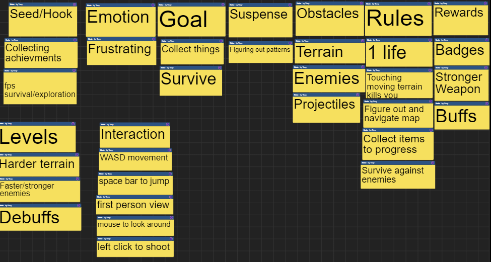

## Welcome to Cube Space's Page

Owners are: Tony Long, Henry Blazier, Jake Hijirida.  
[trello.com/ics485gameproj](https://trello.com/ics485gameproj)

## Group Brainstorm ~

### Seed/Hook
- fun movement
- gravity based platformer
- Platformer + 2D

### Emotion
- Stressful
- Suspense 
- Happiness 
- Satisfaction 

### Goals
- reach the end of the level without suffocating
- try to get faster each time

#### Suspense
- limited time to finish the level

### Obstacles
- Traps 
- Terrain 
- Enemies 
- Turrets

### Interaction/Feedback
- A D for left and right movement
- 1 button for jumping
- W for jumping
- left click for gravity switching

### Rules
- Don't die
- Finish the level as fast as possible

### Rewards
- the satisfaction of completing the level
- Solving a frustrating level

### Levels
- Navigate level until the end without dying
- Reaching the end starts a harder level
- Each level have different obstacles

### Abilities

## Build 1 Video

Link to demo:

[https://simmer.io/@hbzxc/cube-space-build-1](https://simmer.io/@hbzxc/cube-space-build-1)

[https://simmer.io/@hbzxc/cube-space-build-2](https://simmer.io/@hbzxc/cube-space-build-2)

## Individual Brainstorms ~

### Tony's

