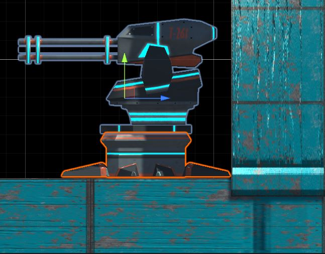
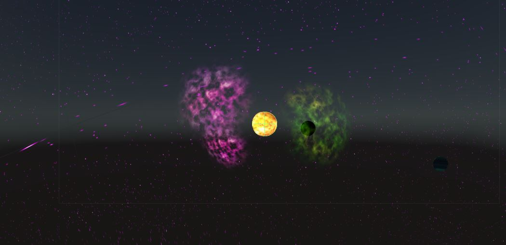
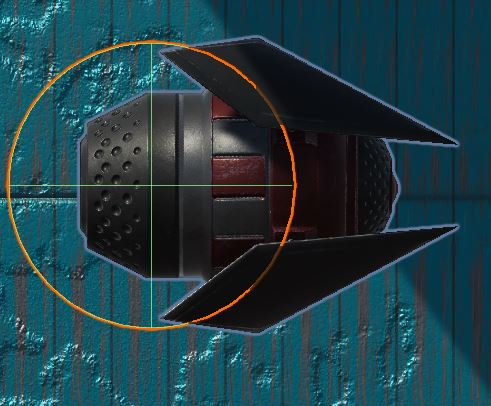
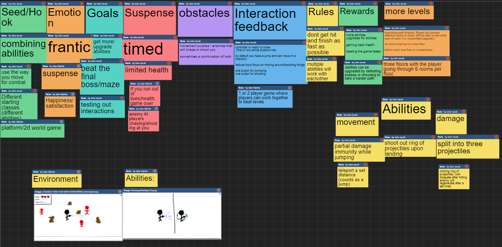
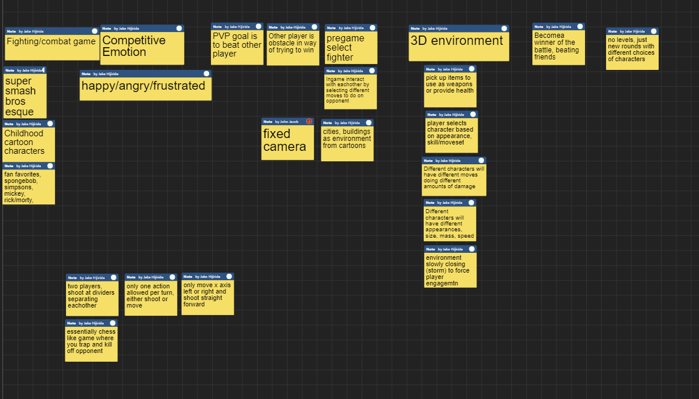

## Welcome to Cube Space's Page

Owners are: Tony Long, Henry Blazier, Jake Hijirida.  
[trello.com/ics485gameproj](https://trello.com/ics485gameproj)

Cube Space is a challenging platform game that puts players focus, speed, and imagination to work. With a Space theme and gravity ability, users will have to traverse the course, avoiding enemy turrets and electrical surfaces, all the while escaping the killer robot that is always just a few steps behind.  

Initially, our game idea was a 2D platformer that was a combat/puzzle game and would allow the user traverse different paths in order to gain classes/abilities. Due to the time constraint we knew that we had to do a lot of simplificaiton but wanted to maintain the suspenseful feeling throughout the game along with the happiness and satisfaction of beating a level. Instead of making a long winding game, we switched courses and did some fine tuning, we decided on one ability the player would have access to which is the gravity switch which would be utilized in creating a puzzle like experience with the manipulation of certain blocks and player movement to reach the end of the level.  

## Final Group Brainstorm/Board ~

### Seed/Hook
- Fun Movement
- Gravity based Platformer
- Skill based Platformer + 2D

### Emotion
- Stressful
- Suspense 
- Happiness 
- Satisfaction 

### Goals
- reach the end of the level avoiding electric blocks and escaping the enemy chasing you
- try to get faster each time
- find new strategies using gravity mechanic

#### Suspense
- limited time to finish the level
- enemy AI chasing you, keeps player progressing through the level

### Obstacles
- Traps 
- Terrain 
- Enemies 
- Turrets

### Interaction/Feedback
- A D for left and right movement
- W for jumping
- left click for gravity switching

### Rules
- Don't hit the electical blocks
- Don't get caught by the enemy AI
- Finish the level as fast as possible

### Rewards
- the satisfaction of completing the level
- Solving a frustrating level

### Levels
- Navigate level until the end without dying
- Reaching the end starts a harder level
- Each level has different obstacles

### Assets

#### Turret

#### Background

#### Enemy

## Build 1 Video

## Build 2 Video

## Build 3 Video

## Final Build Video

## Link to demos:

[https://simmer.io/@hbzxc/cube-space-build-1](https://simmer.io/@hbzxc/cube-space-build-1)

[https://simmer.io/@hbzxc/cube-space-build-2](https://simmer.io/@hbzxc/cube-space-build-2)

[https://simmer.io/@Ripslasher/cube-space-build-3](https://simmer.io/@Ripslasher/cube-space-build-3)

## Individual Brainstorms ~

### Tony's

### Henry's
These are not exclusively my ideas.
We used my board to make tweaks and bring all of our ideas together.

### Jake's

